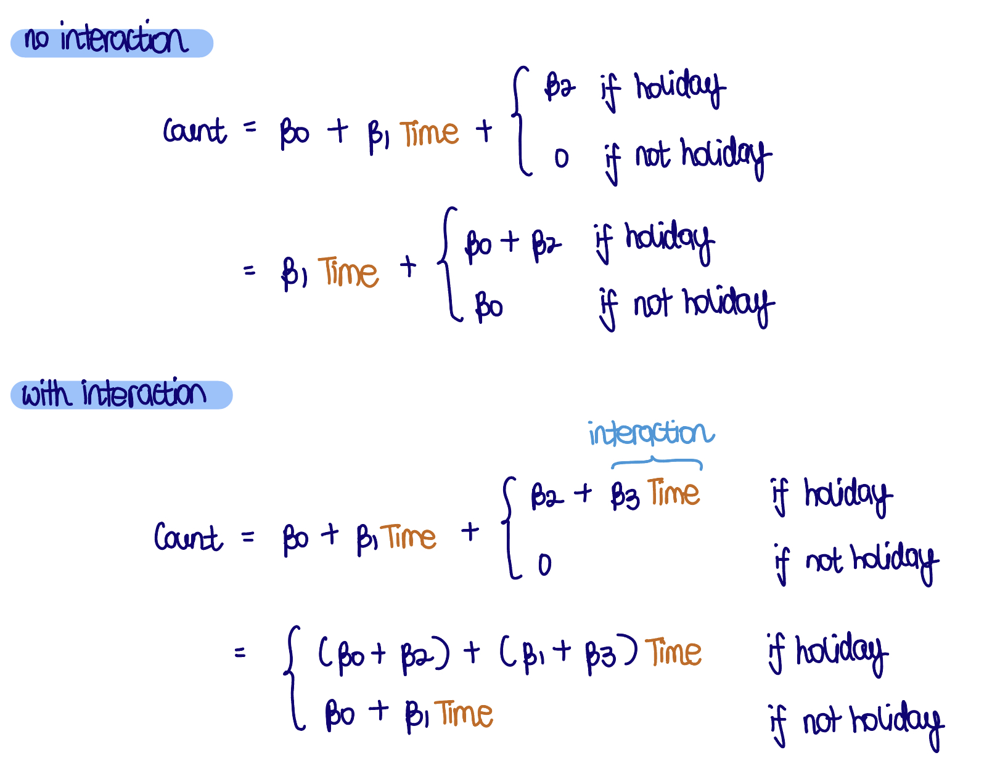

```{r setup, include = FALSE}
knitr::opts_chunk$set(
  echo = FALSE, 
  message = FALSE, 
  warning = FALSE,
  cache.path = "cache/",
  fig.path = "images/tutorial08/",
  fig.align = "center"
)

library(tidyverse)
library(tsibble)
library(brolgar) # remotes::install_github("njtierney/brolgar") 
library(lubridate)
library(DAAG)
library(broom)
library(patchwork)
library(colorspace)
library(GGally)
library(tsibbledata)
library(forcats)
library(chron)

# Set default ggplot2 theme for document
ggplot2::theme_set(theme_bw())
```

# ⛳ Objectives

These exercise are to do some exploratory analysis with graphics and statistical models, focusing on temporal data analysis.  

# 🏌 Preparation 

```{r pkgs, echo=TRUE, eval = FALSE}
install.packages(c("tidyverse", "here", "DAAG", "chron", "broom", "patchwork", "colorspace", "tsibble", "lubridate", "tsibbledata", "forcats", "Gally", "brolgar"))

remotes::install_github("hrbrmstr/streamgraph")
```

# Exercise 1: Australian rain 

This exercise is based on one from Unwin (2015), and uses the `bomregions` data from the `DAAG` package. The data contains regional rainfall for the years 1900-2008. The regional rainfall numbers are area-weighted averages for the respective regions. Extract just the rainfall columns from the data, along with year.

## a.

What do you think area-weighted averages are, and how would these be calculated?

```{r}
data(bomregions, package = "DAAG")
```

* Total rainfall is divided by *geographic area* to get the rainfall on a scale that can be compared across different sized regions.

## b.

Make line plots of the rainfall for each of the 7 regions and the Australian averages. What do you learn about rainfall patterns  across the years and regions? (Hint: you can make these with the `ggduo` function in the `GGally` package.)

```{r}
GGally::ggduo(bomregions,
              columnsX = "Year",
              columnsY = c("seRain", "southRain", "eastRain", 
                           "northRain", "swRain", "qldRain", 
                           "nswRain", "ntRain", "saRain",
                           "tasRain", "vicRain", "waRain",
                           "mdbRain", "ausRain"))
```

* The rainfall patterns are fairly flat across regions. 
* The temporal trend differs a little from one region to another.

## c. 

It can be difficult to assess correlation between multiple series using line plots, and the best way to check correlation between multiple series is to make a scatterplot. Make a `splom` for this data, ignoring year. What regions have strong positive correlation between their rainfall averages?

```{r}
bomregions %>% 
  select(seRain:ausRain) %>% 
  ggpairs()
```

* `EastRain` and `seRain` and `mdbRain` are strongly correlated. 
* `NorthRain` and the Australian totals are strongly correlated. 
* `NorthRain` and `eastRain` are moderately correlated. 
* There are a few outliers (high average) in several regions, particularly the north. 
  * it suggests that there are sometimes heavy rain years in the north.

## d. 

One of the consequences of climate change for Australia is that some regions are likely getting drier. Make a transformation of the data to compute the difference between rainfall average in the year, and the mean over all years. Using a bar for each year, make a bar chart that examines the differences in the yearly rainfall over time. Are there some regions who have negative differences in recent years? What else do you notice?


```{r, fig.width=10, fig.height=12,}
# Mean-centering
med_ctr <- function(x, na.rm = TRUE) {
  x - mean(x, na.rm = TRUE)
}

# Mean center variables & convert to long format
bomrain <- bomregions %>% 
  select(Year, contains("Rain")) %>%
  mutate(across(.cols = contains("Rain"), ~ med_ctr(.x))) %>% 
  pivot_longer(cols = seRain:ausRain, 
               names_to = "area", 
               values_to = "rain")

ggplot(bomrain, 
       aes(x = Year, y = rain)) +
  geom_col() +
  facet_wrap(~ area, 
             ncol = 1)
```

* There doesn't appear to be more negative differences in recent years. 
* Although there is possibly a hint in several regions: `swRain`, `seRain`, `mdbRain.` 
* There  were several years of heavier than average rain in most regions in the early 1970s. Generally the pattern is a few wet years then a few dry years.*

# Exercise 2: US unemployment 

This exercise is based on and example in Oscar Perpinan Lamigueiro (2018) "Displaying Time Series, Spatial, and Space-Time Data with R". Read the US employment data from the book web site. This contains monthly unemployment numbers from 2000 through 2012 in different sectors.

## a. 

Transform the data into tidy long form and convert to a `tsibble`. Make a line plot coloured by sector. What do you learn about unemployment during this time frame from this chart? 

```{r}
# Read-in data
US_unemp <- read_csv("https://raw.githubusercontent.com/oscarperpinan/bookvis/master/data/unemployUSA.csv")
```

```{r}
US_unemp <- US_unemp %>% 
  
  # Remove last col not relating to date
  select(!contains("Annual")) %>%
  
  # Long format for plotting
  pivot_longer(`Jan 2000`:`Dec 2012`, 
               names_to = "date", 
               values_to = "count") %>% 
  
  # Convert to date variable
  mutate(date = dmy(paste("15", date))) %>% 
  
  # Convert to tsibble object
  tsibble::as_tsibble(index = date,
                      key = `Series ID`)

ggplot(US_unemp, 
       aes(x = date, 
           y = count, 
           colour = `Series ID`)) +
  geom_line()
```

**`tsibble` structure:**

* index: time index variable
* key(s): variable(s) that uniquely identify time indices 
  * index & key should be distinct

**Findings**

* 2008 is when unemployment rose in many sectors.  
* In some sectors there is a strong seasonal pattern.

## b.

We are going to re-arrange the data now to examine the monthly patterns by year and sector. Create new variables for month and year from the date variable. Now make a line plot of count by month coloured by year, using an appropriately sequential colour palette, and facet by sector. Are there some sectors that have a seasonal pattern? Are there some sectors who were not affected by the 2008 economic downfall?

```{r}
US_unemp <- US_unemp %>%
  mutate(month = month(date, label = FALSE),
         year = year(date)) 

US_unemp %>% 
  ggplot(aes(x = factor(month), 
             y = count, 
             colour = year, 
             group = year)) +
  geom_line() + 
  facet_wrap(~`Series ID`,
             ncol = 5,
             scales = "free_y") +
  colorspace::scale_colour_continuous_sequential(name = "",
                                                 breaks = seq(2000, 2012, 4)) +
  theme(legend.position = "bottom")
```

* In the earlier years, unemployment rates follow a similar pattern
* In the later year (e.g. after 2008), unemployment rates sky-rocketed, probably due to the financial crisis
* Some sectors, eg LNU03028615, LNU03032231 and LNU03035181 have a strong seasonal pattern. 
  * LNU03035181 and LNU03032237 appear to be less affected by the economic downfall.

## c. 

This next way to look at the data is like a stacked bar chart for time series. Using the same code as in question a., change `geom_line` with `geom_area`, to stack the series, with a different fill colour for each sector. What do you learn about the magnitude of the 2008 economic crisis? Can you read much from this chart about the effect on different sectors?

```{r, fig.width = 12, fig.height = 8, out.width = "100%"}
ggplot(US_unemp, 
       aes(x = date,
           y = count, 
           fill = `Series ID`)) +
  geom_area(position = "stack",
            colour = "grey30") + 
  scale_x_date("", date_breaks = "3 years", 
               date_labels = "%Y") +
  scale_fill_discrete("") +
  theme(legend.position = "bottom")
```

* The big increase in unemployed after 2008 is emphasised by this chart. It's difficult to examine the individual sectors, though.


```{r fig.width=12, fig.height=8, out.width="100%"}
# remotes::install_github("hrbrmstr/streamgraph")
library(streamgraph)
US_unemp %>% 
  rename("sector" = `Series ID`) %>%
  streamgraph(key = "sector",
              value = "count", 
              date = "date") 
```

* This is a similar type of plot called a "stream graph". It generates this as an interactive plot, which is great for exploring multiple nested time series.*

# Exercise 3: Lynx trappings periodicity

This is a classic data example: Annual numbers of lynx trappings for 1821–1934 in Canada, from Brockwell & Davis (1991). It is a classic because it looks periodic, but it really doesn't have a period. Here we look at two ways to examine the cyclic nature to check for periodicity.

## a.

Create two new variables by rounding the year into a decade, and the remainder into a year in the decade.

```{r}
# Convert to tsibble object
lynx_tsb <- as_tsibble(datasets::lynx) %>% 
  rename(count = value)
```

## b.

Make a line plot of count by year. Add a vertical line every 10 years. If you start from 1928, the location of the first peak, you can check the  peak locations in  subsequent years. Is the peak roughly every 10 years?

```{r}
ggplot(lynx_tsb, aes(x = index, y = count)) +
  # Starting from first peak, check if peak occurs at every decade
  geom_vline(xintercept = seq(1828, 1928, 10), colour = "orange") +
  geom_line() + 
  labs(title = "Anual Canadian Lynx trappings",
       y = "Number trapped") 
```

* The orange vertical lines mark each decade, and the first one matches the first peak. 
  * For the first few decades the line matches the peak, but as time progresses the peak arrives a little earlier than the decade.

## c. 

Cut the series into decades, and make overlaid line plots of count vs year in decade, using decade as the group variable. This is like looking at seasonality, like we might look at seasonal patterns in a year by examining the months. If the series is cyclic, particularly with peaks every 10 years, the peaks should line up. Do they?

```{r}
# Extract decade and year for each decade
lynx_tsb <- lynx_tsb %>%
  mutate(decade = floor(index/10), 
         yr_decade = index %% 10)

# Draw line plot for each decade
p1 <- ggplot(lynx_tsb, aes(x = factor(yr_decade), 
                     y = count, 
                     group = decade)) +
  geom_line() 
```

* Snipping the series into 10 year blocks does not produce a matching of the peaks. 
* Although it looks like a 10 year cycle, it appears to be a little less than that, and slightly irregular.
  * Therefore, there is no seasonality in the data

# Exercise 4: Missing values in NYC bikes data

In [Earo Wang's blog post](https://blog.earo.me/2018/12/20/reintro-tsibble/) introducing `tsibble` she used NYC bikes data. This data is now made available in the `tsibbledata` package. Each observation describes a trip event about a registered bike at a particular time point

## a.

Focusing on May, aggregate the data to hour, and count the number of trips in each hour. 

```{r}
# Compute number of trips made for each hour on a given day
hourly_trips <- tsibbledata::nyc_bikes %>% 
  filter_index("2018 May") %>% 
  # Round down to the nearest hour & group by the specific variable
  # index_by(start_hour...) is the same as mutate(start_hour...) %>% group_by(start_hour)
  index_by(start_hour = floor_date(start_time, unit = "1 hour")) %>% 
  summarise(ntrips = n())
```

* `filter_index()`: shorthand for filtering time index
* `index_by()` allows grouping of time index by calling an arbitrary function to the index
  * `floor_date()`, `ceiling_date()` & `round_date()` are useful functions
    - `round_date()`: Rounds date-time object to nearest value of specified time unit   
    - `floor_date()`: Rounds (down) ...
    - `ceiling_date()`: Rounds (up) ...


## b.

Has the data got missing values?

```{r}
# Checks if implicit missingness exists
hourly_trips %>% 
  tsibble::has_gaps()

# Report all implicit missing observations
hourly_trips %>% 
  tsibble::scan_gaps() 

# Summarise time ranges that are absent from the data
hourly_trips %>% 
  tsibble::count_gaps(.full = TRUE) 

# Fill missing values with 0
hourly_trips %>% 
  tsibble::fill_gaps(ntrips = 0L)
```

Yes.


## c. 

Make a line plot of the hourly trips over the month. Why does it look like there are no missings? Why is the line not broken by missings? 

```{r fig.width=10, fig.height=2, out.width="100%"}
# Focus on a single day, see how missingness is plotted from 10:00 to 15:00
hourly_trips %>% 
  filter_index("2018-05-01") %>% 
  ggplot(aes(x = start_hour, y = ntrips)) +
  geom_line() +
  geom_point()
```

* There are a lot of gaps. It's hard to see where they are because there are missings everywhere!
* The line extends from one hour to the next hour (regardless if the next hour is not a 1-hour interval)

## d. 

Use `fill_gaps` to make implicit missings explicit. Re-make the line plot from question c again. 

```{r}
hourly_trips %>% 
  filter_index("2018-05-01") %>% 
  # Impute NA values for missing hour
  fill_gaps(.full = TRUE,
            ntrips = 0) %>% 
  ggplot(aes(x = start_hour, y = ntrips)) +
  geom_line() +
  geom_point()
```

* The missing values are extensive.

## e.

To focus on the missings, we can make a plot of the places where there are gaps, by plotting the data created by the `count_gaps` function. How extensive are the missing values?

```{r}
# Summarise time range that is absent from the data
nycbikes_gaps <- hourly_trips %>% 
  filter_index("2018-05-01") %>% 
  count_gaps(.full = TRUE) 

nycbikes_gaps %>% 
  ggplot() +
  geom_linerange(aes(xmin = .from, xmax = .to, y = 1),
                 size = 1) +
  geom_point(aes(x = .from, y = 1)) +
  geom_point(aes(x = .to, y = 1)) 
```


## f.

Focusing on the hour when missings occur, check if there are some times of the day that missings are more frequent. 

```{r nycbikes, eval=FALSE}
# Extracting the specific hour where the data is missing (i.e. no bikes rented)
scan_gaps(hourly_trips) %>%
  # Comptue hours in which there are no observation(s)
  mutate(time = hour(start_hour)) %>% 
  ggplot(aes(x = time)) +
  geom_bar()
```

* There are more missings in the night and early mornings *i.e.* 2000 - 0500
  * This is plausible as most people will be asleep at these times

# Exercise 5: Imputing missings for pedestrian sensor using a model

We saw in the lecture notes that imputing by simple method such as mean or moving average doesn't work well with multiple seasonality in a time series. Here we will use a linear model to capture the seasonality and produce better imputations for the pedestrian sensor data (from the `tsibble` package).

## a.

What are the multiple seasons of the pedestrian sensor data, particularly the traffic at QV market, or Southern Cross Station?

```{r}
# Let's look at second week of Jan 2015 for both locations
pedestrian %>% 
  filter(str_detect(Sensor, "Southern Cross|QV Market")) %>% 
  filter_index("2015-01-01" ~ "2015-01-18") %>% 
  mutate(day_of_week = wday(Date, label = TRUE)) %>% 
  ggplot() +
  geom_line(aes(x = Date_Time, 
                y = Count)) +
  facet_wrap(~ Sensor,
             nrow = 2) +
  scale_x_datetime(date_breaks = "1 day", date_labels = "%a")
```

**Time series patterns**

(1) *Trend*: long term increase/decrease in the data
(2) *Seasonality*: Occurs when time series is affected by seasonal factors such as time of year or time of the week
  * Frequency is unchanging & associated with some aspect of the calendar
(3) *Cyclic*: Occurs when data exhibits rise/falls that are not of fixed frequency

**Findings**

* The work day/non-working day typically has a daily different pattern

## b.

Check and fill the gaps for the pedestrian sensor data with NA. Subset to just the QV market sensor.

```{r}
# There are gaps for each sensor
pedestrian %>% 
  has_gaps(.full = TRUE)

# Some gaps are long, e.g. 1128 hours
ped_gaps <- pedestrian %>%
  count_gaps(.full = TRUE) %>% 
  count(.n)

# Fill gaps with NA values
ped_full <- pedestrian %>% 
  fill_gaps(.full = TRUE, Count = NA) 
```


## c. 

Create a new variable to indicate if a day is a non-working day, called `hol`. Make hour a factor - this helps to make a simple model for a non-standard daily pattern.

```{r}
# Extract Victoria's public holidays
hol <- holiday_aus(year = 2015:2016, state = "VIC") 

# For QVM, determine if day is a working day
ped_qvm <- ped_full %>% 
  filter(str_detect(Sensor, "QV Market")) %>% 
  # Determine if day is a non-working day (i.e. public holiday or weekend)
  mutate(hol = if_else(Date %in% hol$date, TRUE, FALSE),
         hol = if_else(is.weekend(Date), TRUE, hol)) %>% 
  # Extract hour of the day
  mutate(Time = hour(Date_Time),
         Time = factor(Time))
```

## c.

Fit a linear model with Count as the response on  predictors `Time` and `hol` interacted. 

```{r}
# In general, we see that there are more pedestrians when it is a holiday
ped_qvm %>% 
  filter(Time %in% as.character(1:10)) %>% 
  ggplot() +
  geom_boxplot(aes(x = Time, 
                   y = Count,
                   fill = hol),
               outlier.shape = NA) +
  labs(x = "Hour")
```

* Note that, when it is a holiday, `Count` does not increase/decrease the same across the different hours
  * This means that an interaction term for a linear model is more reasonable

```{r}
# Fit linear model

# With no interaction, holTRUE holds the same value
ped_qvm_lm <- lm(Count ~ Time + hol, data = ped_qvm)

# With interaction, holTRUE holds a different value for each hour
ped_qvm_lm <- lm(Count ~ Time * hol, data = ped_qvm)
```

```{r}
# Formula

```


## d. 

Predict the count for all the data at the sensor. 

```{r}
ped_qvm <- ped_qvm %>% 
  mutate(pred = predict(ped_qvm_lm, .))
```


## e. 

Make a line plot focusing on the last two weeks in 2015, where there was a day of missings, where the missing counts are substituted by the model predictions. Do you think that these imputed values match the rest of the series, nicely?

```{r}
# Filter to last 10 days of Dec 2015
ped_qvm_sub <- ped_qvm %>% 
  filter_index("2015-12-21" ~ "2015-12-31")

ggplot(ped_qvm_sub) +   
  geom_line(aes(x = Date_Time, y = Count)) +
  geom_line(data = filter(ped_qvm_sub, !is.na(Count)),
            aes(x = Date_Time,
                y = pred),
            colour = "orange") +
  scale_x_datetime("", date_breaks = "1 day", 
                   date_labels = "%a %d")
```

* Cylic patterns of the data such as public holidays (*e.g.* Christmas day) are not captured particularly well


# Exercise 6: Men's heights 

The `heights` data provided in the `brolgar` package contains average male heights in 144 countries from 1500-1989. 

```{r}
data(heights, package = "brolgar")
help(heights, package = "brolgar")
```


## a.

What's the time index for this data? What is the key?

* Time index is year
  * `[!]` indicates that the time index is irregular
* Key is country.

## b.

Filter the data to keep only measurements since 1700, when there are records for many countries. Make a spaghetti plot for the values from Australia. Does it look like Australian males are getting taller?

```{r}
# Measurements since 1700
heights <- heights %>% filter(year > 1700)

heights %>% 
  filter(country == "Australia") %>% 
  ggplot(aes(x = year,
             y = height_cm)) +
  geom_point() +
  geom_line()
```

* It appears that Australian males are getting taller

## c.

Check the number of observations for each country. How many countries have less than five years of measurements? Filter these countries out of the data, because we can't study temporal trend without sufficient measurements. 

```{r}
# Keep countries with >= 5 observations
heights <- heights %>% 
  # add no. of observations for each key
  brolgar::add_n_obs() %>% 
  filter(n_obs >= 5)
```


## d.

Make a spaghetti plot of all the data, with a smoother overlaid. Does it look like men are generally getting taller?

```{r}
ggplot(heights,
       aes(x = year,
           y = height_cm)) +
  geom_line(aes(group = country), alpha = 0.3) +
  geom_smooth(se = FALSE)
```

* Generally, it looks like men are generally getting taller across the globe

## e.

Use `facet_strata` to break the data into subsets using  the `year`, and plot is several facets. What sort of patterns are there in terms of the earliest year that a country appears in the data?

```{r}
# Convert to tsibble object
heights <- as_tsibble(x = heights,
                      index = year,
                      key = country,
                      regular = FALSE # indicate irregular time interval
                      )

ggplot(data = heights, 
       aes(x = year,
           y = height_cm,
           group = country)) + 
  geom_line() + 
  # Stratify along all groups except year
  brolgar::facet_strata(along = c(height_cm, n_obs), 
                        n_strata = 12)
```

* Stratify helps group/sort observations (countries, in our case) into similar groups 
  * *e.g.* `facet_strata(along = height_cm)` takes the mean value of average height (`height_cm`) & no. of observations (`n_obs`) of each country to group into each strip
* From the plot, countries are pretty evenly distributed across the facets


## f. 

Compute the three number summary (min, median, max) for each country. Make density plots of these statistics, overlaid in a single plot, and a parallel coordinate plot of thee three statistics. What is the average minimum (median, maximum) height across countries? Are there some countries who have roughly the same minimum, median and maximum height?

```{r}
# For each key, extract three features (min, median, max)
heights_three <- heights %>%
  brolgar::features(height_cm, 
                    c(min = min,
                      median = median,
                      max = max))

# Convert to long format for plotting
heights_three_long <- heights_three %>% 
  pivot_longer(cols = min:max,
               names_to = "feature",
               values_to = "value")
```

```{r}
# Density plot
p1 <- heights_three_long %>% 
  ggplot(aes(x = value,
             fill = feature)) + 
  geom_density(alpha = 0.5) +
  labs(x = "Value",
       y = "Density",
       fill = "Feature") + 
  scale_fill_discrete_qualitative(palette = "Dark 3") +
  theme(legend.position = "top",
        aspect.ratio = 1)

# Parallel coordinate plot
p2 <- heights_three_long %>% 
  ggplot(aes(x = feature,
           y = value,
           group = country)) + 
  geom_line(alpha = 0.6) +
  theme(aspect.ratio = 1)


# Error bars
p3 <- heights_three %>%
  mutate(country = fct_reorder(country, median)) %>% 
  ggplot() + 
  geom_point(aes(x = country,
                 y = median)) +
  geom_linerange(aes(x = country, 
                     ymin = min, 
                     ymax = max), 
                alpha = 0.6, width = 0) +
  labs(x = "",
       y = "heights") +
  coord_flip()
 
design <- "
1133
2233
"

p1 + p2 + p3 + 
  plot_layout(design = design)
```

* The average minimum height is about 164cm, median is about 168cm and tallest is about 172cm. 
* The maximum height appears to be bimodal, with a small peak around 178cm.
* Most countries have the expected pattern of increasing heights from minimum, median to maximum. 
* There are a few which have very similar values of these, though, which is a bit surprising. It means that there has been no change in these metrics over time.


## g. 

Which country has the shortest men? Which country has the tallest men? Which country has highest median male height? Would you say that the distribution of heights within a country is similar for all countries?

```{r}
# Tallest men
heights_three %>% 
  select(country, max) %>% 
  slice_max(max, n = 3)

# Highest median
heights_three %>% 
  select(country, median) %>% 
  slice_max(median, n = 3)

# Shortest men
heights_three %>% 
  select(country, min) %>% 
  slice_max(min, n = 3)
```

* Denmark has the tallest men. 
* Estonia has the tallest median height. 
* Papua New Guinea has the shortest men. 

